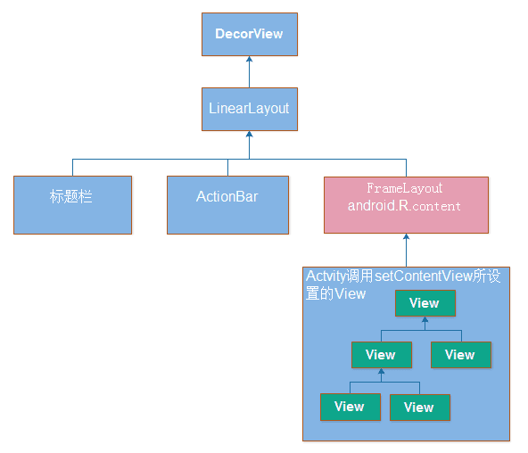

# 目录
###### [1. Dialog错误： BadTokenException: Unable to add window -- token null is not for an application？](#1)


* * *

<h2 id="1">1. Dialog错误： BadTokenException: Unable to add window -- token null is not for an application？</h2>


#### 解答：
**先来理清一些概念**


#### Window

    定义窗口样式和行为的抽象基类，用于作为顶层的view加到WindowManager中，其实现类是PhoneWindow。
    每个Window都需要指定一个Type（应用窗口、子窗口、系统窗口）。
    Activity对应的窗口是应用窗口；
    PopupWindow，ContextMenu，OptionMenu是常用的子窗口；
    像Toast和系统警告提示框（如ANR）就是系窗口，还有很多应用的悬浮框也属于系统窗口类型。

#### WindowManager
    
    用来在应用与window之间的管理接口，管理窗口顺序，消息等。
    
#### WindowManagerService
    简称Wms，WindowManagerService管理窗口的创建、更新和删除，显示顺序等。
    是WindowManager这个管理接品的真正的实现类。
    它运行在System_server进程，作为服务端，客户端（应用程序）通过IPC调用和它进行交互。
    
#### Token
    这里提到的Token主是指窗口令牌（Window Token），是一种特殊的Binder令牌。
    Wms用它唯一标识系统中的一个窗口。
    
*
    
##### 下图显示了Activity的Window和Wms的关系：


    Activity有一个PhoneWindow，当我们调用setContentView时，其实最终结果是把我们的DecorView作为子View添加到PhoneWindow的DecorView中。
    而最终这个DecorView，过WindowMnagerImpl的addView方法添加到WMS中去的，由WMS负责管理和绘制（真正的绘制在SurfaceFlinger服务中）。



#### Dialog的窗口属于什么类型

    跟Activity对应的窗口一样，Dialog有一个PhoneWindow的实例。
    Dialog 的类型是TYPE_APPLICATION，属于应用窗口类型。
    
##### 可以从Dialog的创建代码得到确认

```java
    Dialog(@NonNull Context context, @StyleRes int themeResId, boolean createContextThemeWrapper) {
        // 忽略一些代码
        mWindowManager = (WindowManager) context.getSystemService(Context.WINDOW_SERVICE);

        final Window w = new PhoneWindow(mContext);
        mWindow = w;
        w.setCallback(this);
        w.setOnWindowDismissedCallback(this);
        w.setWindowManager(mWindowManager, null, null);
        w.setGravity(Gravity.CENTER);

        mListenersHandler = new ListenersHandler(this);
    }
```
> 注意w.setWindowManager(mWindowManager, null, null)这句，把appToken设置为null。这也是Dialog和Activity窗口的一个区别，Activity会将这个appToken设置为ActivityThread传过来的token。

```java
    public void setWindowManager(WindowManager wm,IBinder appToken, String appName)
```

##### 然后在Dialog的show方法中

```java
    public void show() {
        // 忽略一些代码
        mDecor = mWindow.getDecorView();
        WindowManager.LayoutParams l = mWindow.getAttributes();
        if ((l.softInputMode
                & WindowManager.LayoutParams.SOFT_INPUT_IS_FORWARD_NAVIGATION) == 0) {
            WindowManager.LayoutParams nl = new WindowManager.LayoutParams();
            nl.copyFrom(l);
            nl.softInputMode |=
                    WindowManager.LayoutParams.SOFT_INPUT_IS_FORWARD_NAVIGATION;
            l = nl;
        }
        try {
            mWindowManager.addView(mDecor, l);
            mShowing = true;
            sendShowMessage();
        } finally {
        }
    }
```

> mWindow是PhoneWindow类型，mWindow.getAttributes()默认获取到的Type为TYPE_APPLICATION。
> Dialog最终也是通过系统的WindowManager把自己的Window添加到WMS上。在addView前，Dialog的token是null（上面提到过的w.setWindowManager第二参数为空）。
> Dialog初化始时是通过Context.getSystemServer 来获取 WindowManager，而如果用Application或者Service的Context去获取这个WindowManager服务的话，会得到一个WindowManagerImpl的实例，这个实例里token也是空的。之后在Dialog的show方法中将Dialog的View(PhoneWindow.getDecorView())添加到WindowManager时会给token设置默认值还是null。

> 如果这个Context是Activity，则直接返回Activity的mWindowManager，这个mWindowManager在Activity的attach方法被创建，Token指向此Activity的Token，mParentWindow为Activity的Window本身。如下的代码Activity重写了getSystemService这个方法：

```java
    @Override
    public Object getSystemService(@ServiceName @NonNull String name) {
        if (getBaseContext() == null) {
            throw new IllegalStateException(
                "System services not available to Activities before onCreate()");
        }
        if (WINDOW_SERVICE.equals(name)) {
            return mWindowManager;
        } else if (SEARCH_SERVICE.equals(name)) {
            ensureSearchManager();
            return mSearchManager;
        }
        return super.getSystemService(name);
    }
```
> 系统对TYPE_APPLICATION类型的窗口，要求必需是Activity的Token，不是的话系统会抛出BadTokenException异常。Dialog 是应用窗口类型，Token必须是Activity的Token。

#### 问题的答案

    那为什么一定要是Activity的Token呢？我想使用Token应该是为了安全问题，通过Token来验证WindowManager服务请求方是否是合法的。
    如果我们可以使用Application的Context，或者说Token可以不是Activity的Token，那么用户可能已经跳转到别的应用的Activity界面了，但我们却可以在别人的界面上弹出我们的Dialog，想想就觉得很危险。
    如你跳到了微信界面了，这时在后台的某个应用里调用Dialog的show，那么微信的界面上会显示一个Dialog，这个Dialog可能会让用户输入密码什么的，而用户完全无法区分是不是微信弹出的。

> 文章来源 [@goeasyway](http://www.jianshu.com/users/f9fbc7a39b36/latest_articles)
