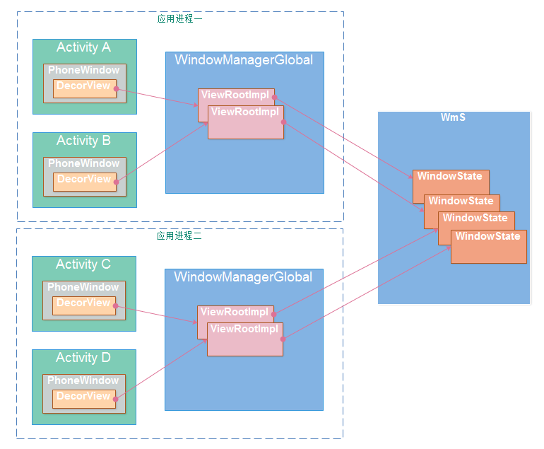

# 目录
###### [1. Dialog错误： BadTokenException: Unable to add window -- token null is not for an application？](#1)

* * *

<h2 id="1">1. Dialog错误： BadTokenException: Unable to add window -- token null is not for an application？</h2>

#### 解答：
**先来理清一些概念**

#### Window

    定义窗口样式和行为的抽象基类，用于作为顶层的view加到WindowManager中，其实现类是PhoneWindow。
    每个Window都需要指定一个Type（应用窗口、子窗口、系统窗口）。
    Activity对应的窗口是应用窗口；
    PopupWindow，ContextMenu，OptionMenu是常用的子窗口；
    像Toast和系统警告提示框（如ANR）就是系窗口，还有很多应用的悬浮框也属于系统窗口类型。

#### WindowManager
    
    用来在应用与window之间的管理接口，管理窗口顺序，消息等。
    
#### WindowManagerService
    简称Wms，WindowManagerService管理窗口的创建、更新和删除，显示顺序等。
    是WindowManager这个管理接品的真正的实现类。
    它运行在System_server进程，作为服务端，客户端（应用程序）通过IPC调用和它进行交互。
    
#### Token
    这里提到的Token主是指窗口令牌（Window Token），是一种特殊的Binder令牌。
    Wms用它唯一标识系统中的一个窗口。
    
*
    
##### 下图显示了Activity的Window和Wms的关系：

    Activity有一个PhoneWindow，当我们调用setContentView时，其实最终结果是把我们的DecorView作为子View添加到PhoneWindow的DecorView中。
    而最终这个DecorView，过WindowMnagerImpl的addView方法添加到WMS中去的，由WMS负责管理和绘制（真正的绘制在SurfaceFlinger服务中）。
